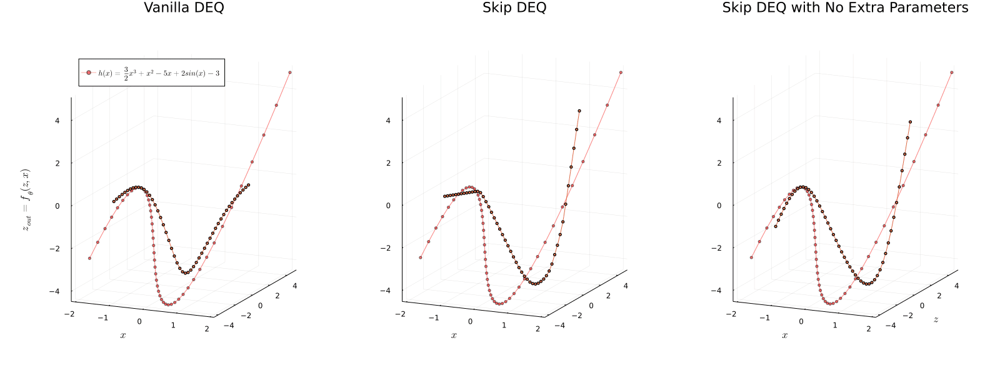

# FastDEQ



Official Implementation for *Mixing Implicit and Explicit Deep Learning with Skip DEQs and Infinite Time Neural ODEs (Continuous DEQs)* (https://arxiv.org/abs/2201.12240)

## Installation

This package relies on some unreleased packages which need to be manually installed

```julia
] add https://github.com/avik-pal/FluxExperimental.jl.git
] add DiffEqSensitivity#ap/fastdeq
] add https://github.com/avik-pal/Zygote.jl.git#ap/fastdeq
] add https://github.com/avik-pal/FastDEQ.jl
```

## Implemented Models

* `DeepEquilibriumNetwork`: The standard DEQ Layer https://arxiv.org/abs/1909.01377.
* `SkipDeepEquilibriumNetwork`: Our version of faster DEQ Model.
* `MultiScaleDeepEquilibriumNetwork`
* `MultiScaleSkipDeepEquilibriumNetwork`
* `DEQChain`: Use `DEQChain` instead of `Chain` if your model contains a `DEQ` or `SkipDEQ` layer.

## Non-Linear Solvers

* `BroydenSolver`
* `LimitedMemoryBroydenSolver`

## Experiments

1. [polynomial_fitting.jl](experiments/polynomial_fitting.jl) -- Comparing the Performance of SkipDEQ and DEQ when fitting on `y = x^2`
   *  Execute like a normal julia script 
2. [mnist_mdeq.jl](experiments/mnist_mdeq.jl) -- Supervised MNIST Classification using MDEQ
   *  See [mnist_mdeq.sh](scripts/mnist_mdeq.sh) for an example slurm script. It uses paths and details corresponding to our internal cluster so it is very likely that you need to modify the parameters before running the script. (If you are running this on MIT Supercloud just modify the `cd ...` line)
3. [cifar10_deq.jl](experiments/cifar10_deq.jl) -- Supervised CIFAR-10 Classification using MDEQ
   *  See [cifar_mdeq.sh](scripts/cifar_mdeq.sh) -- Similar to MNIST this will require modifications. (If you are running this on MIT Supercloud just modify the `cd ...` line)

### Some Notes:

1. The `MPI` binaries provided by binary builder will probably not be GPU aware. If it isn't `FluxMPI` will display a warning. All the code will work but the transfer will most likely be slower. My personal recommendation is to compile `openmpi` with `ucx` and `cuda` support and setup `MPI.jl` to use this compiled binary. It is likely to cost about 30 mins to setup but will save massive pains.
2. The slurm scripts are written assuming the 2 GPUs are V100s with 32GB GPU Memory. In that is not the case, reduce `mpiexecjl -np <value>` to a lower number (1 process will approximately take 10GB memory).


## Troubleshooting

1. `libhdf5.so` not found: If you have admin priviledges, just install hdf5 for your system. Else install `h5py` using Conda and export a new environment `JULIA_HDF5_PATH="<path to (ana|mini)conda>/lib"`. Next do `]build` in the Julia REPL.

## Citing

If you are using this project for research or other academic purposes consider citing our paper:

```bibtex
@misc{pal2022mixing,
      title={Mixing Implicit and Explicit Deep Learning with Skip DEQs and Infinite Time Neural ODEs (Continuous DEQs)}, 
      author={Avik Pal and Alan Edelman and Christopher Rackauckas},
      year={2022},
      eprint={2201.12240},
      archivePrefix={arXiv},
      primaryClass={cs.LG}
}
```

For specific algorithms cite:

1. Deep Equilibrium Models:
```bibtex
@inproceedings{bai2019deep,
  author    = {Shaojie Bai and J. Zico Kolter and Vladlen Koltun},
  title     = {Deep Equilibrium Models},
  booktitle = {Advances in Neural Information Processing Systems (NeurIPS)},
  year      = {2019},
}
```

2. Multiscale Deep Equilibrium Models:
```bibtex
@inproceedings{bai2020multiscale,
  author    = {Shaojie Bai and Vladlen Koltun and J. Zico Kolter},
  title     = {Multiscale Deep Equilibrium Models},
  booktitle = {Advances in Neural Information Processing Systems (NeurIPS)},
  year      = {2020},
}
```

3. Jacobian Stabilization:
```bibtex
@inproceedings{bai2021stabilizing,
  title     = {Stabilizing Equilibrium Models by Jacobian Regularization},
  author    = {Shaojie Bai and Vladlen Koltun and J. Zico Kolter},
  booktitle = {International Conference on Machine Learning (ICML)},
  year      = {2021}
}
```

4. Skip DEQs and Skip MDEQs:
```bibtex
@misc{pal2022mixing,
      title={Mixing Implicit and Explicit Deep Learning with Skip DEQs and Infinite Time Neural ODEs (Continuous DEQs)}, 
      author={Avik Pal and Alan Edelman and Christopher Rackauckas},
      year={2022},
      eprint={2201.12240},
      archivePrefix={arXiv},
      primaryClass={cs.LG}
}
```

